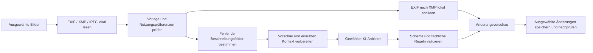

# KI-Metadaten: Fenster, Batch, Chat und JSON-Vorlagen

Stand: 27.09.2026. Ergänzung zum [Modernisierungsplan](GUI-AI-Update-Plan.md), Branch `GUI-AI-Update`. Konkreter Implementierungsentwurf mit maschinenlesbaren Beispielen. Der Umsetzungsstand steht im Hauptplan, Abschnitt 10; noch offen sind nativer Provider-Batch, LearningOptOutIn-Decodierung/-Schreiben und eingebettetes XMP. Es wurden keine Bilder hochgeladen, keine kostenpflichtigen Modellaufrufe ausgeführt und keine Cloudressourcen angelegt.

## Ziel und Beispieldateien

Das eigene Fenster „KI-Metadaten“ analysiert ausgewählte Bilder einzeln oder im Stapel. Eine versionierte JSON-Vorlage definiert Prompt, Felder, Wertebereiche, EXIF-Kontext, XMP-Ziele, Nutzungspräferenzen, Kostenlimits und Schreibregeln. Ein Chat kann Werte oder die Vorlage ändern; Änderungen werden als prüfbarer Vorschlag dargestellt.

- [Vollständige Beispielvorlage](examples/ai-metadata.template.json)
- [Schema der erwarteten Modellantwort](examples/ai-metadata.response.schema.json)
- [Fiktive Beispielantwort](examples/ai-metadata.response.example.json), keine tatsächlich durchgeführte Bildanalyse

Die Vorlage ist ein **anwendungseigenes Konfigurationsformat**, kein direkt an einen Anbieter sendbarer API-Request. Die Anwendung erstellt daraus kurze Prompts, das Antwortschema und anbieterspezifische Requests. Kosten-, Schreib- und Rechtekonfiguration bleiben lokal. `credential-manager:` verweist auf einen Eintrag in der Windows-Anmeldeinformationsverwaltung (umgesetzt in `Services/CredentialStore.cs`), nicht auf einen API-Schlüssel oder ein standardisiertes Cloudformat. Azure-Endpoint und Deployment werden aus den benannten Einstellungen/Umgebungsvariablen aufgelöst.

Das Beispiel verwendet die OpenAI API mit dem Profil `openai-economy` und `gpt-5-mini` als Standard. Azure und Gemini bleiben auswählbare Alternativen. „gpt5-minin“ wird als dieses Modell interpretiert. Azure erwartet im Request den tatsächlichen **Deployment-Namen**, nicht zwangsläufig den Modellnamen. Dieser ist noch nicht bekannt. Für die Dokumentationsarbeit war keine Anmeldung erforderlich; der Foundry-Skill-Prüflauf meldete ein fehlendes `azd`. Das betrifft spätere Deployment-Workflows, nicht diese API-Planung; es wurde dafür nichts installiert.

## Anbieter und aktuelle API-Techniken

| Profil | Geplante Anbindung | Verwendung |
| --- | --- | --- |
| Azure GPT-5 mini | Azure OpenAI v1 Responses API, Entra-ID-Anmeldung, Structured Outputs | Optionaler Anbieter für Bildanalyse und Chat. Tatsächliches Deployment/Region vor Nutzung prüfen. |
| OpenAI Economy | Responses API, `gpt-5-mini`, Bildinput und Structured Outputs | Standardanbieter für Bildanalyse und Chat; kostenbewusstes Profil mit optional nativer Batch-Verarbeitung. |
| OpenAI aktuelle Generation | Responses API, `gpt-6-luna`, zunächst nur Evaluationsprofil | Aktuelle Modellgeneration auf demselben Referenzdatensatz gegen GPT-5 mini messen; nicht ohne Kosten-/Qualitätsnachweis automatisch umstellen. |
| Google Gemini | Native `generateContent`-API, `gemini-3.5-flash-lite`, Bildinput und Structured Outputs | Aktuell dokumentierte stabile, auf Durchsatz und Kosten ausgerichtete Flash-Lite-Option; Batch oder interaktiv. |

Es gibt keinen allgemeinen „ChatGPT-Account“-Login für diese Integration: verwendet werden die OpenAI-API und ihre eigenen Zugangsdaten. Azure und Google werden separat eingerichtet. Keine Browserautomatisierung der Chat-Webseiten.

OpenAI dokumentiert Bildinput und Structured Outputs für GPT-5 mini. Für die aktuelle Modellgeneration wird die Responses API empfohlen. Die explizite Azure-Modellwahl bleibt erhalten. Quellen: [GPT-5 mini](https://developers.openai.com/api/docs/models/gpt-5-mini), [aktuelle OpenAI-Modellführung](https://developers.openai.com/api/docs/guides/latest-model), [GPT-6 Luna](https://developers.openai.com/api/docs/models/gpt-6-luna).

Azure dokumentiert GPT-5 mini mit Responses/Structured Outputs. Die gelesene Global-Batch-Modelltabelle bestätigt **nicht** GPT-5 mini. Deshalb zunächst lokale Queue mit begrenzter Parallelität; nativen Azure-Batchmodus nur bei bestätigter Kombination aus Deployment, Modell, Region und Modalität aktivieren. Kein stiller Wechsel zu GPT-5.4 mini. Quellen: [Azure Structured Outputs](https://learn.microsoft.com/en-us/azure/foundry/openai/how-to/structured-outputs), [Azure Responses](https://learn.microsoft.com/en-us/azure/foundry/openai/how-to/responses), [Azure Batch](https://learn.microsoft.com/en-us/azure/foundry/openai/how-to/batch).

Gemini 3.5 Flash-Lite unterstützt laut Modellseite Bilder, strukturierte Antworten, Caching und Batch. Aktuelle APIs nutzen, ohne unnötige Agenten-/Suchwerkzeuge einzubauen: Diese Aufgabe benötigt überwiegend eine Bildklassifikation mit eng begrenzter Ausgabe. Quellen: [Gemini-Modell](https://ai.google.dev/gemini-api/docs/models/gemini-3.5-flash-lite), [Structured Outputs](https://ai.google.dev/gemini-api/docs/structured-output).

Capabilities werden pro Provider **und** Modell gepflegt: Vision, zulässiges JSON-Schema-Subset, Reasoning-Parameter, Bildauflösung, Streaming, Batch und Speicheroptionen. Das vorhandene lokale Antwortschema wird in das unterstützte Providerformat übersetzt. Nicht serverseitig unterstützte Grenzen werden weiter lokal validiert. Insbesondere Parameter wie `temperature`, `reasoning.effort` und Gemini-Thinking-Einstellungen sind nicht austauschbar.

## Verarbeitung: lokal zuerst, KI nur für fehlende beschreibende Angaben

1. Bildrevision und Originalmetadaten erfassen. EXIF-Aufnahmedatum, Artist, Copyright und GPS zunächst lokal nach passenden XMP-Datentypen konvertieren. Nicht einfach rohe EXIF-DMS-Strings als XMP-GPS schreiben; bekannte Zeitzonen erhalten und unbekannte nicht erfinden.
2. Existierende XMP-Werte standardmäßig erhalten (`fillMissing`), Stichwörter dedupliziert ergänzen (`mergeUnique`). Widersprüche anzeigen. Falls keine KI-Felder fehlen und keine erneute Analyse angefordert wurde, keinen API-Aufruf ausführen.
3. Für die Modellanfrage ausschließlich freigegebene, normalisierte Felder senden. Standardmäßig Datum ohne Zeit, Hemisphäre statt exakter GPS-Position, vorhandene Beschreibung/Stichwörter; keine Kameraseriennummer und kein Dateipfad. Metadatentexte begrenzen, als untrusted Daten behandeln.
4. Orientierungsbereinigte Vorschau erzeugen: standardmäßig maximal 1024 px lange Kante, Seitenverhältnis beibehalten, nicht hochskalieren. Vorschau enthält keine eingebetteten Metadaten. Transparenz im JPEG auf einen definierten Hintergrund setzen; Originalpixel bleiben unangetastet.
5. Providerprofil übersetzt die neutrale Auflösungswahl. Keine pauschale Behauptung, `detail=low` oder die kleinere Dateigröße spare bei jedem Modell gleich viele Tokens. Bildtokenrechnung des konkreten Modells und Erkennungsqualität anhand Stichprobe messen. Quellen: [OpenAI Vision](https://developers.openai.com/api/docs/guides/images-vision), [Gemini Image Understanding](https://ai.google.dev/gemini-api/docs/image-understanding).
6. Pro Bild ein strukturiertes Ergebnis, keine riesige Bildcollage. Bildidentität wird durch lokale Request-ID/Batch-custom_id und Dokumentrevision gesichert, nicht durch eine vom Modell erfundene Dateiangabe.
7. Nur validierte Felder in eine lokale Änderungsliste aufnehmen. Refusal, abgeschnittene Ausgabe, ungültige Werte und veraltete Bildrevision sind eigene Zustände. Keine direkten Schreibbefehle des Modells ausführen.

### Beispiel Jahreszeit

`jahreszeit` darf ausschließlich Winter, Frühling, Sommer, Herbst oder `null` sein. Die vier Begriffe werden normalisiert geschrieben. `null` bedeutet: nicht zuverlässig bestimmbar, vorhandenen Wert nicht verändern. Monat oder Schnee allein reichen nicht für eine sichere Zuordnung; Hemisphäre, Höhenlage, Innenraum und tropische Szenerie können die Schlussfolgerung einschränken.

Das Beispiel speichert den Wert in der **eigenen** XMP-Eigenschaft `pge:Season`, Namespace `urn:picturegeoexif:metadata:1.0`. Dies ist ausdrücklich kein vorgegebener EXIF-/IPTC-Standardtag. Optional lässt sich die Jahreszeit zusätzlich als Stichwort abbilden. Die Modell-Konfidenz ist eine unkalibrierte Selbsteinschätzung, keine garantierte Wahrscheinlichkeit; 0,8 ist lediglich eine konfigurierbare Review-Schwelle. Anfangs werden alle Vorschläge geprüft.

## LearningOptOutIn und bestehende EXIF-Daten

Vorhandene Nutzungspräferenzen werden aus EXIF/XMP gelesen und erhalten. **Normale EXIF-Daten wie Kameramodell, Datum, GPS oder Copyright erlauben keine automatische Ableitung einer KI-Trainingserlaubnis.** Für fehlende Angaben gelten ausschließlich ausdrücklich gewählte Vorlagenwerte oder eine manuelle Entscheidung.

Die Vorlage enthält ein Beispielpreset: Training und Data Mining opt-out, Foundation-Model-Eingabe nicht festgelegt. Es wird nur bei vollständig fehlendem Präferenz-Tag angeboten und erst nach Übernahme geschrieben. Dies ist keine bereits erklärte Nutzerpräferenz. „Unspecified“, fehlende Werte, unbekannte Codes und Konflikte bleiben unterscheidbar. Das Modellantwortschema enthält bewusst keine Rechtefelder.

`XMP.CipaExif31LearningPreferences` ist in der Vorlage ein **logisches Anwendungsziel**, kein behaupteter XMP-Tagname. Der Writer muss es erst nach dem in Abschnitt 7 des Hauptplans geforderten Normabgleich auf das tatsächliche CIPA-Schema abbilden. Bis dahin bleibt diese Teiländerung ausstehend. EXIF-Schreiben setzt den validierten Exif31-/Container-Writer voraus. Eine XMP-Sidecar-Datei ersetzt keinen eingebetteten EXIF-Tag. Nicht erledigte Ziele werden nicht als gespeichert markiert.

Vor Upload zuerst bestehende Angaben auswerten: explizites Opt-out für Model Input führt im geplanten Produkt zum Überspringen; unklare Angaben zu einer sichtbaren Entscheidung für den Lauf. Ein Startentscheid über eine Cloudanalyse schreibt nicht automatisch Opt-in in die Datei. Die Vorlage darf nicht erst Rechte ändern, um dadurch ihren eigenen Upload zu autorisieren. Trainings-Opt-out und Nutzung zur Inferenz sind getrennte Kategorien.

## Kostenmodell und Batch-Betrieb

Zwei auswählbare Betriebsarten:

- **Sofort/Stapel:** lokale persistente Queue, geringe Parallelität, Fortschritt pro Bild, Pause/Fortsetzen und selektive Wiederholung. Für Azure GPT-5 mini der erste Implementierungspfad.
- **Kostenoptimierter Provider-Batch:** asynchrone Jobs; Ergebnisse später abholen. OpenAI und Gemini dokumentieren 50 % Rabatt gegenüber ihren jeweiligen synchronen Standardtarifen und einen 24-Stunden-Verarbeitungsrahmen bzw. Zielzeitraum. Nur einsetzen, wenn diese Wartezeit passt. Quellen: [OpenAI Batch](https://developers.openai.com/api/docs/guides/batch), [Gemini Batch](https://ai.google.dev/gemini-api/docs/batch-api).

Budget und Tokens:

- Nur fehlende Felder berechnen; alle benötigten Beschreibungsfelder in einem Bildaufruf zusammenfassen. Keine separate Anfrage je Stichwort oder Jahreszeit.
- Kompakter stabiler Prompt-/Schema-Präfix, variable Bilddaten danach. Provider-Caching nur bei erfüllten Bedingungen kalkulieren; ein kurzer Prompt wird nicht automatisch rabattiert. Explizites Gemini-Caching erst verwenden, wenn Wiederverwendung die Speicher-/Einrichtungskosten rechtfertigt. [OpenAI Prompt Caching](https://developers.openai.com/api/docs/guides/prompt-caching), [Gemini Tarife](https://ai.google.dev/gemini-api/docs/pricing).
- Ergebnis-Cache enthält Hash von Bildinhalt/Revision, relevanten Metadaten, Vorlage, Schema, Vorverarbeitung, Provider und Modellversion. Geänderte Rechte werden auch vor Wiederverwendung geprüft. Unbekannte Alias-Versionen mit Cache-Ablauf behandeln.
- Reasoning auf niedrigste qualitätsgeprüfte unterstützte Stufe, kurze Antworten und kurze Belege statt langer Erklärungen. Thinking/Reasoning kann das Ausgabelimit und Kosten mitverbrauchen; ein zu niedriges Limit darf nicht in unbegrenzte kostenpflichtige Wiederholungen führen.
- Die Beispielgrenzen 5 USD/Lauf und 0,03 USD/Bild sind **konfigurierbare Budgetgrenzen, keine Preisprognose**. Vor Start Preise für Modell, Provider, Region, Verarbeitungsmodus und Währung verifizieren. Fehlende Preise blockieren den kostenbehafteten Start, nicht die lokale Vorschau.
- Kosten = nicht gecachte Eingabetokens × Eingabetarif + gecachte Tokens × Cachetarif + abrechenbare Ausgabetokens × Ausgabetarif, jeweils pro Million, plus gegebenenfalls weitere Kosten. Keine doppelte Zählung von Reasoning-Tokens, falls Usage sie bereits in Output enthält. Rabatte nicht blind miteinander multiplizieren; Azure-Tarife nicht von OpenAI übernehmen.
- Reserve für laufende Requests, begrenzte Wiederholungen und sämtliche Requests eines eingereichten Batch-Jobs **vor** Versand buchen. Ein Abbruch garantiert keine Rückerstattung bereits verarbeiteter Requests; das App-Limit ist keine providerseitige Abrechnungssperre.
- 429/5xx mit begrenztem Backoff, Jitter und Retry-After. Timeout nach Versand zunächst abgleichen, bevor ein möglicherweise bereits bezahlter Job erneut eingereicht wird. Kein automatischer Anbieterwechsel mit Bildtransfer.

Die Jobdatenbank speichert Provider-Job-ID, Request-ID, Bildhash/Revision, Vorlagenversion, Status, Resultat, Usage, Preisstand und abgerechnete/geschätzte Kosten. Zustände mindestens: vorbereitet, wartet auf Entscheidung, eingereiht, gesendet, läuft, Ergebnis erhalten, zu prüfen, angewendet, teilweise angewendet, fehlgeschlagen, abgebrochen. Ergebnisse über IDs zuordnen; Batch-Ausgabereihenfolge nicht voraussetzen.

## Eigenes WPF-Fenster

Geplant: `AiMetadataWindow` mit eigenem ViewModel und Commands. Während eines Jobs bleibt die Anwendung bedienbar; Fenster schließen stoppt nicht ungefragt einen bereits eingereichten Cloudjob. Laufende Dokumentrevisionen werden gegen konkurrierende Editoränderungen abgesichert.

| Bereich | Inhalt |
| --- | --- |
| Kopf | Anbieter/Modell, Vorlage, Sofort/Provider-Batch, geschätzte Kosten, Budget |
| Links | Bildliste mit Mehrfachauswahl, Thumbnail, Status und Filtern „Fehlend / Konflikt / Fehler“ |
| Mitte | Bildvorschau und Metadatentabelle: Feld, bisheriger Wert, Vorschlag, Quelle, Beleg, übernehmen |
| Rechts | Tabs „Vorlage & JSON“, „Regeln“, „Chat“; JSON validieren, importieren und als neue Version speichern |
| Fuß | Lokal prüfen, Testlauf mit wenigen Bildern, Analyse starten, Pause/Abbrechen, Ergebnisse abholen, ausgewählte Änderungen speichern |

Keine internen JSON-/API-Details in den normalen Ablauf zwingen: Feldregeln können im Formular gepflegt werden; JSON ist die gleichwertige Expertenansicht. Eine Änderung im Formular aktualisiert dieselbe Vorlage. Unbekannte Regeln/Namespaces werden beim Import angezeigt und nicht still ignoriert.

### Metadaten-Chat

Der Chat arbeitet wahlweise auf dem aktuellen Bild, der sichtbaren Auswahl oder der Vorlage. Der Umfang ist vor jeder Übernahme sichtbar. Beispiele:

- „Setze die Jahreszeit dieser 20 Bilder auf Winter.“ → manueller Änderungsvorschlag, keine erneute Bildanalyse nötig.
- „Behalte alle Stichwörter und ergänze nur fehlende Motive.“ → neue Vorlagenversion und optional erneute Analyse betroffener Felder.
- „Warum ist bei Bild 17 die Jahreszeit unklar?“ → vorhandenes Resultat/Beleg verwenden.
- „Generatives Training soll nicht erlaubt sein.“ → expliziter Rechteänderungsvorschlag aus Nutzertext, nicht aus der Bildanalyse.

Chat gibt begrenzte typisierte Aktionen zurück (`proposeFieldValues`, `proposeTemplateChanges`, `explainConflict`), keine beliebigen Dateipfade, Shellbefehle oder XML-Fragmente. Feldnamen, Umfang und Werte lokal validieren. Anwendung nur über „Änderungen übernehmen“, mit Undo/Audit. Einfache Formularänderungen bleiben ohne Modellaufruf möglich. Das Chat-Aktionsschema wird separat vom Bildanalyse-Antwortschema implementiert.

Für Folgefragen nur kompakte Metadaten, aktuelle Auswahl, akzeptierte Entscheidungen und wenige letzte Nachrichten verwenden. Bilder standardmäßig nicht erneut senden; erneute visuelle Analyse gezielt anfordern. Chatverlauf und Prompt-Cache sind nicht automatisch kostenlose Kontextspeicher.

## .NET-Bausteine und Implementierungsfolge

| Baustein | Verantwortung |
| --- | --- |
| `IAiMetadataProvider` + drei Adapter | Analyse, Chat, Capabilities, Usage, optional Submit/Get/CancelBatch; keine Dateischreibrechte |
| `MetadataTemplateService` | Versionierte Konfiguration, lokale Schemavalidierung, zugelassene Feld-/Konverterregistrierung |
| `MetadataContextBuilder` | Lokales Lesen, EXIF-Konvertierung, minimierter Modellkontext, Aufnahme-/GPS-Validierung |
| `LearningPreferenceResolver` | Vorhandene Rechte, Konflikte, explizite Vorlagenwerte und Uploadentscheidung getrennt |
| `AiImagePreprocessor` | Orientierung, begrenzte Vorschau, keine versteckten Metadaten im Upload |
| `AiBatchCoordinator` | Persistente Queue, Resume, Deduplizierung, Abbruch und Jobabgleich |
| `AiCostEstimator` | Versionierter Tarifkatalog, Reservierungen, Usage-Abgleich |
| `MetadataProposalService` | Zusammenführen ohne Datenverlust, Feldherkunft, Diff und Review |
| `MetadataWriter` | Bereits geplante sichere EXIF-/XMP-/Sidecar-Schreibschicht, Nachprüfung |
| `AiMetadataWindowViewModel` | Auswahl, Providerprofil, Chat, Fortschritt und Commands |

1. Vorlagenvertrag und beide Antwortverträge (Analyse/Chat), Domänenmodell und Mockprovider.
2. Lokale Metadatenübernahme, Jahreszeit-/Rechteregeln und Änderungsvorschau ohne Cloud.
3. OpenAI-Adapter als Standard mit wenigen ausdrücklich gestarteten Referenzbildern; anschließend Azure GPT-5 mini mit vorhandenem Deployment und Gemini anhand derselben Tests.
4. Kostenmessung, persistente Queue, Cache und Provider-Batch, soweit unterstützt.
5. Eigenes Fenster mit JSON/Formular und Metadaten-Chat.
6. Validierter Writer und Ende-zu-Ende-Abnahme. Bis zur Writer-Freigabe nur Vorschläge/unterstützte Sidecars, kein vorgetäuschter vollständiger EXIF-3.1-Export.

Referenzdatensatz: alle Jahreszeiten, Innenräume, Tropen, Schnee im Sommer, Südhalbkugel, widersprüchliches Datum, fehlende GPS-/Rechteangaben, bestehende XMP-Werte, Bild mit instruktivem Text. Pro Provider Kosten pro **akzeptiertem** Ergebnis, Latenz, Null-/Fehlerquote und notwendige Korrekturen messen. Keine automatische Entscheidung allein nach Listenpreis oder Modell-Konfidenz.

Abnahme zusätzlich: fehlerhafte JSON-Vorlage, unbekannter Zieltag, Refusal, Limitüberschreitung, 429, Timeout nach Versand, vertauschte Batch-Reihenfolge, Neustart während Job, geändertes Bild vor Anwenden, Duplikat, Konflikt EXIF/XMP, invalides Datum/GPS, Sidecar-Kollision und unterbrochener Schreibvorgang. Schlüssel außerhalb von JSON/Repository speichern; Logs enthalten standardmäßig keine Bilder, kompletten Prompts oder exakten GPS-Daten. Anbieteraufbewahrung ist getrennt von Datei-Nutzungspräferenzen darzustellen; temporäre Uploads nach Ergebnisübernahme gemäß Providerfähigkeit löschen.
