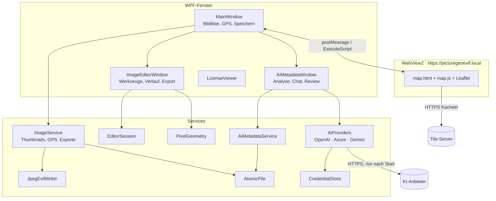
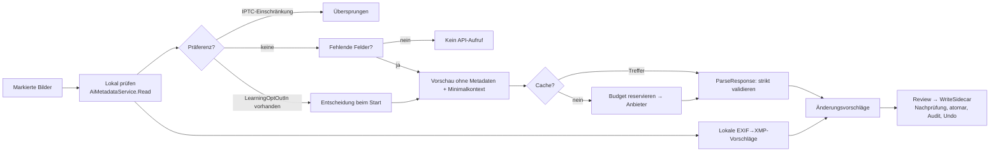

# Architektur

PictureGeoExif ist eine WPF-Desktopanwendung (.NET 10, Windows 10 1809+). Die Fenster enthalten die Bedienlogik (Code-behind). Fachlogik ohne UI liegt in `Services/` und ist dort testbar. Die Dateizuordnung steht im [Code-Wegweiser](Code-Wegweiser.md).

## Komponenten

## Datenflüsse

### Bilder laden und GPS setzen

1. `MainWindow.LoadImages` legt `ImageItem`-Einträge an. `ImageService.CreateThumbnailAsync` erzeugt gecachte Thumbnails, `ReadExifData` liest GPS.
2. GPS kommt aus einem Kartenklick (`coordinates`-Nachricht), aus einem Referenzbild oder aus dem ausgewählten Bild.
3. **Speichern** kopiert das Original mit `ImageService.SaveSingleImage` kollisionsfrei in den Ausgabeordner und schreibt dort GPS. **Das Original bleibt unverändert.**

### Virtuelle Trassen (`RouteBuilder`)

1. GPS-Punkte werden lokal metrisch projiziert. Punkte mit höchstens `RouteMaxGapMeters` Abstand (auch über Zwischenpunkte) bilden eine Trasse (Single-Linkage).
2. Ein **minimaler Spannbaum** verbindet die Punkte einer Trasse. Der **Hauptstrang** ist der Baumpfad zwischen den beiden Blattknoten mit dem größten Luftlinienabstand. Anders als der längste Pfad läuft er nicht in einen langen Hausanschluss am Trassenende.
3. **Zacken entfernen:** Bei weit auseinanderliegenden Hauptstrangfotos kann der Spannbaum über einen seitlichen Punkt laufen. Ein Punkt weiter als `RouteBranchMinMeters` neben der Abkürzung seiner Nachbarn wird aus dem Hauptstrang genommen, wenn der Strang davor und danach seine Richtung beibehält (±30°, auch einen Punkt weiter geprüft). Bei einer echten Ecke ändert sich die Richtung, der Punkt bleibt.
4. **Abzweige:** Fotos weiter als `RouteBranchMinMeters` von der Hauptstranglinie bilden Abzweige, zusammenhängend im Spannbaum. Ein Abzweig setzt am **Lotfußpunkt** auf dem Hauptstrang an (direkter Weg zur Trasse); seine Fotos sind nach Entfernung vom Ansatzpunkt geordnet. Näher liegende Fotos gelten als GPS-Streuung und werden nach Position entlang der Linie in den Hauptstrang einsortiert.
5. Überwiegt die Nord-Süd-Ausdehnung, läuft der Hauptstrang Süd → Nord, sonst West → Ost. Die Trassen werden nach ihrem Startpunkt nummeriert.
6. `Route.Points` ist die Gesamtreihenfolge für die Bildliste: Hauptstrangfotos entlang des Laufs, Abzweig-Fotos direkt hinter ihrer Ansatzstelle. `MainWindow.RebuildRoutes` setzt „Trasse n · Nr. k (· Abzweig)“, ordnet optional die Liste und überträgt Hauptstrang und Abzweige an die Karte.

### Trassen an Wege anlegen (`RoadMatcher`)

- **Auslösung:** nur nach Klick und Bestätigung (pro Server und Sitzung).
- **Anfrage:** Hauptstrang und jeder Abzweig werden getrennt gematcht (Abzweig ab seinem Ansatzpunkt auf dem Hauptstrang). Die Punkte gehen an `POST {Server}/trace_attributes` (Valhalla, `shape_match=map_snap`, `search_radius` = maximaler Abstand, Profil `pedestrian`/`bicycle`/`auto`).
- **Antwort:** die Weggeometrie (encoded polyline, Genauigkeit 6) und je Foto der Abstand zum Weg.
- **Fotos abseits der Wege:** Fotos über der Grenze oder `unmatched` werden gerade verbunden; die übrigen Abschnitte werden einzeln gematcht. Grenzen: höchstens 12 Anfragen je Trasse, höchstens 250 Punkte.
- **Schonung des öffentlichen Servers:** eine Verbindung, global mindestens 1,1 s zwischen Anfragen, App-User-Agent, keine automatischen Wiederholungen. Ergebnisse werden pro Trassengeometrie und Einstellung im Speicher gecacht.
- **Fotokoordinaten** bleiben unverändert; das Ergebnis ist reine Darstellung (Ebene „Wegverlauf“).

### GPS schreiben (`ImageService.WriteGpsToImage`)

- **JPEG:** `Image.Identify` liest nur die Metadaten, dann wird das GPS im `ExifProfile` gesetzt. `JpegExifWriter.ReplaceExif` ersetzt ausschließlich das EXIF-APP1-Segment; Bilddaten, ICC, XMP und andere Segmente bleiben bytegleich.
- **PNG/TIFF:** verlustfreie Neukodierung mit gesetztem `ExifProfile`.
- **BMP und andere:** werden abgelehnt, denn diese Formate können kein EXIF speichern.
- **Vor dem Ersetzen** liest MetadataExtractor das Ergebnis im Speicher unabhängig nach. Erst danach schreibt `AtomicFile.Write`.

### Bildeditor

- `EditorSession.OpenAsync` prüft Format, Größe (max. 80 Megapixel) und Einzelbild, richtet die Orientierung nach EXIF aus (AutoOrient) und speichert den Ausgangszustand als **verlustfreies PNG** im Temp-Ordner.
- Jede Operation läuft über `ApplyAsync` im Hintergrund. Sie wird **erst nach erfolgreichem Speichern** in die Historie übernommen; Fehler oder Abbruch lassen den vorherigen Zustand unverändert. Die Historie umfasst maximal 31 Stände bzw. 1 GB.
- Die Auswahl wird in Bildpixeln gespeichert (`PixelGeometry.Selection`, exklusive rechte und untere Kante). Zoom und Monitor-DPI beeinflussen weder Auswahl noch Effektstärke.
- Vorschau und Anwenden verwenden dieselbe Pixel-Engine.
- Der Export kodiert erst am Ende (`ExportAsync`): PNG, JPEG (Qualität wählbar, Transparenz auf Weiß), TIFF oder BMP. Das Hauptfenster speichert die Bytes über `ImageService.SaveEditedImage`.

### KI-Metadaten

- **Anbieter:** OpenAI und Azure nutzen die Responses API mit `text.format = json_schema, strict`. Gemini nutzt `generateContent` mit `responseJsonSchema`. Längenlimits entfernt `AiProviderFactory.ProviderSchema` für den Anbieter; lokal werden sie weiter geprüft.
- **Wiederholungen** gibt es nur bei 429 und 5xx, mit `Retry-After`, Backoff und Jitter. Bricht die Verbindung nach dem Senden ab oder läuft ein Timeout ab, wird **nicht** wiederholt (`Ambiguous`), weil die Anfrage bereits abgerechnet sein kann.
- **Kosten:** Pro Bild wird vor dem Senden der Worst Case reserviert (geschätzte Eingabetokens plus maximale Ausgabetokens). Abgerechnet wird nach den tatsächlich gemeldeten Tokens. Ohne eingetragene und datierte Preise startet kein Lauf.
- **Cache:** Der Schlüssel ist ein SHA-256 über Vorschau, Kontext, Vorlage, Anbieter, Modell, Vorverarbeitung und Schema. Einträge gelten 30 Tage.
- **Schreiben:** nur ins **XMP-Sidecar**, nur für die freigegebenen Zielfelder (`Targets`). Ist das Bild seit der Prüfung verändert (Hash), wird das Schreiben verweigert. Unbekannte XMP-Eigenschaften bleiben erhalten.

## Sicherheits- und Integritätsregeln

| Regel | Umsetzung |
| --- | --- |
| Originale nie verändern | Exporte und GPS nur auf Kopien im Ausgabeordner; KI schreibt Sidecars |
| Kein Teilzustand auf der Platte | `AtomicFile.Write`: temporäre Datei im Zielordner, `File.Replace`/`File.Move` |
| Kein stilles Überschreiben | `AtomicFile.ExportPath`: Zeitstempel mit Millisekunden plus GUID; `overwrite: false` |
| Karte isoliert | Virtual Host nur für `Resources/`, CSP, Navigation nur auf eigenen Ursprung, externe Links nur OSM/Leaflet/Attribution im Systembrowser, Webnachrichten typisiert und validiert |
| Keine Fremdidentität | OSM-Anfragen mit echtem WebView2-User-Agent plus `PictureGeoExif/<Version> (+Repo-URL)` (`Services/AppInfo.cs`) |
| Routing-Server schonen | Drosselung ≥ 1,1 s, eine Verbindung, kein Retry, Cache; nur Koordinaten, nur nach Bestätigung |
| KI-Daten minimieren | Vorschau ohne Metadaten; Datum ohne Uhrzeit; Hemisphäre statt GPS; keine Pfade oder Seriennummern; Metadaten ausdrücklich als „nicht vertrauenswürdige Daten“ gekennzeichnet |
| Modell schreibt nichts direkt | Antworten sind strikt typisiert; der Chat hat nur drei Aktionen; übernommen wird nur nach Review |
| Rechte nie raten | Das Antwortschema hat keine Rechtefelder; Vorlagen mit `allowModelInference: true` werden abgelehnt; `LearningOptOutIn` wird nicht geschrieben |
| Geheimnisse | Windows Credential Manager oder Umgebungsvariable; nie in Vorlage, Einstellungen oder Log |

## Speicherorte zur Laufzeit

| Pfad | Inhalt | Lebensdauer |
| --- | --- | --- |
| `%APPDATA%\PictureExifclone\settings.json` | Ausgabeordner, Tile-Anbieter, KI-Preise, zuletzt genutzte Vorlage | dauerhaft |
| `%APPDATA%\PictureExifclone\templates\` | Selbst gespeicherte KI-Vorlagenversionen | dauerhaft |
| `%LOCALAPPDATA%\PictureGeoExif\WebView2\` | Browserprofil und Kachel-Cache der Karte | dauerhaft (HTTP-Cache) |
| `%LOCALAPPDATA%\PictureGeoExif\ai-cache\` | Validierte KI-Antworten (JSON, ohne Bilder) | 30 Tage gültig |
| `%LOCALAPPDATA%\PictureGeoExif\ai-audit\audit.jsonl` | Protokoll gespeicherter Metadatenänderungen | dauerhaft |
| `%TEMP%\PictureGeoExif\<GUID>\` | Editor-Historie (PNG) | wird beim Schließen des Editors gelöscht |
| `%TEMP%\PictureExifclone_<GUID>\` | Thumbnails | wird beim Beenden gelöscht |
| Ausgabeordner (Standard `Dokumente\PictureExifclone_Output\JJJJMMTT\`) | Exporte und GPS-Kopien | dauerhaft |
| `<Bild>.<ext>.xmp` neben dem Original | KI- und lokale Metadaten | dauerhaft |
| Windows-Anmeldeinformationen `PictureGeoExif/OpenAI`, `PictureGeoExif/Gemini` | API-Schlüssel | bis zum Löschen |

## Bekannte Grenzen

- `LearningOptOutIn` (EXIF 3.1) wird erkannt, aber noch nicht decodiert oder geschrieben, bis der Abgleich mit der CIPA-Norm erfolgt ist.
- XMP wird nur als Sidecar geschrieben, nicht ins Bild eingebettet.
- Beim Neuserialisieren von EXIF durch ImageSharp können Offsets in herstellerspezifischen MakerNotes ungültig werden. Die Bilddaten sind davon nicht betroffen.
- Der native Batch-Modus der Anbieter ist nicht umgesetzt; die Verarbeitung läuft über eine lokale Queue.
- „Alle speichern“ und „GPS auf alle anwenden“ laufen noch synchron im UI-Thread.
